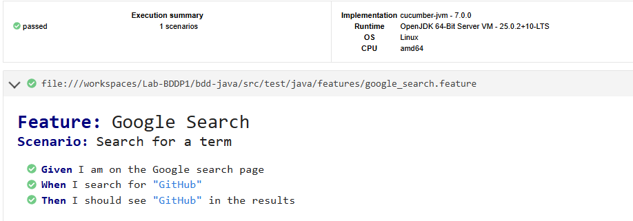

# Laboratorio BDD parte 1 

## Descripción del laboratorio

En este laboratorio se implementó una prueba automatizada utilizando **BDD (Behavior Driven Development)** en Java.  
El objetivo fue crear un escenario de prueba que simule una búsqueda en Google y verifique que el resultado esperado aparezca en la página.

Para esto se utilizaron herramientas como **Cucumber**, **Selenium WebDriver** y **Maven** para gestionar dependencias y ejecutar las pruebas.

## Objetivo

El objetivo del laboratorio fue aprender a implementar pruebas automatizadas utilizando la metodología **BDD**, escribiendo escenarios en lenguaje natural y conectándolos con código Java que ejecuta las acciones reales en un navegador.

Además, se buscó  integrar herramientas de automatización como **Selenium** con **Cucumber** dentro de un proyecto gestionado con **Maven**.

## Metodología

Para desarrollar la solución se siguieron los siguientes pasos:

1. **Creación del proyecto Maven**
   - Se configuró un proyecto Java utilizando Maven para manejar las dependencias y la ejecución de pruebas.

2. **Definición del escenario en Cucumber**
   - Se creó un archivo `.feature` donde se definió el escenario de prueba utilizando lenguaje natural (Gherkin).

   Ejemplo del escenario:

   ```gherkin
   Scenario: Search for a term
     Given I am on the Google search page
     When I search for "GitHub"
     Then I should see "GitHub" in the results

3. **Implementación de los Step Definitions**
   - Se implementaron las clases Java que conectan cada paso del escenario con acciones reales usando Selenium WebDriver.
  
4. **Configuración del Test Runner**
   - Se creó una clase TestRunner para ejecutar los escenarios de Cucumber utilizando JUnit.

5. **Ejecución de las pruebas**
   - Las pruebas se ejecutaron usando el comando: mvn test

## Tecnologias 
  - Java
  - Maven
  - Cucumber
  - Selenium WebDriver
  - JUnit
  - ChromeDriver

## Resultado descarga Test 

